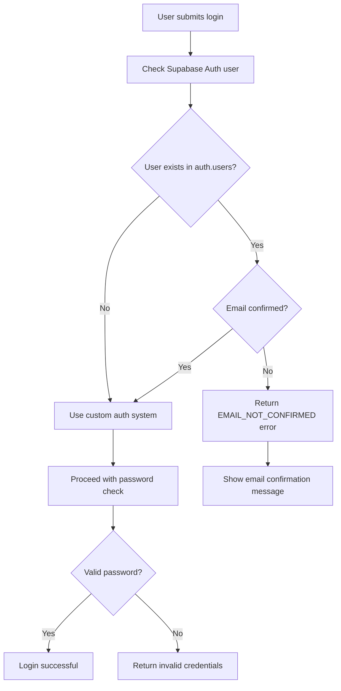
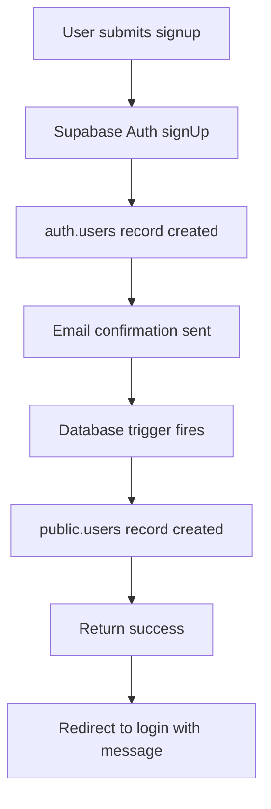

# Email Confirmation Issue Fix

## 🔍 **Why This Issue Occurs**

### **The Problem**
Users sign up successfully but login fails with "Invalid email or password" because **Supabase Auth requires email confirmation by default**, but the login system wasn't detecting this scenario.

### **Root Cause**
1. **Signup Flow**: Uses `supabase.auth.signUp()` which creates `auth.users` record
2. **Email Confirmation**: Supabase sends confirmation email by default
3. **Login Attempt**: User tries to login before confirming email
4. **Supabase Blocks**: Unconfirmed users cannot authenticate
5. **Generic Error**: Login API shows "Invalid email or password" instead of "Email not confirmed"

### **Technical Details**
- Supabase Auth has **two separate systems**:
  - `auth.users`: Managed by Supabase Auth (requires email confirmation)
  - `public.users`: Custom table (created by database trigger)
- The signup creates both, but login was only checking the custom system
- Unconfirmed emails block Supabase Auth operations

## ✅ **Fix Applied**

### **1. Enhanced Login API**
**File**: `frontend/app/api/auth/login/route.ts`

**Added**: Supabase Auth user status checking before custom authentication

```typescript
// Check if user exists in Supabase Auth and email confirmation status
const { data: authUser, error: authError } = await supabase.auth.admin.getUserByEmail(normalizedEmail)

if (authUser?.user && !authUser.user.email_confirmed_at) {
  return NextResponse.json({
    error: 'Please confirm your email address before signing in...',
    code: 'EMAIL_NOT_CONFIRMED',
    hint: 'Click the confirmation link in your email, then try signing in again.'
  }, { status: 401 })
}
```

### **2. Improved Login UI**
**File**: `frontend/app/login/page.tsx`

**Added**: Proper handling of email confirmation errors

```typescript
if (data.code === 'EMAIL_NOT_CONFIRMED') {
  setError(data.error) // Shows the detailed message with instructions
} else {
  setError(data.error || "Invalid email or password")
}
```

### **3. Development Helper Script**
**File**: `frontend/scripts/disable-email-confirmation.js`

**Purpose**: Disable email confirmation for development environments

```bash
cd frontend
node scripts/disable-email-confirmation.js
```

## 🛠️ **How to Fix This Issue**

### **Option 1: Enable Email Confirmation (Production)**
1. **Keep current setup** - users must confirm emails
2. **Login page shows**: "Please confirm your email address before signing in"
3. **Users click**: confirmation link in email
4. **Then login**: works normally

### **Option 2: Disable Email Confirmation (Development)**
1. **Run the script**:
   ```bash
   cd frontend && node scripts/disable-email-confirmation.js
   ```
2. **Or manually**:
   - Go to [Supabase Dashboard](https://app.supabase.com)
   - Authentication → Settings
   - Uncheck "Enable email confirmations"
   - Check "Enable email auto-confirm"
3. **Result**: Signup → immediate login (no email needed)

## 🔧 **Technical Implementation**

### **Login Flow (After Fix)**



### **Signup Flow (After Fix)**



## 📋 **Testing Instructions**

### **Test Email Confirmation (Production)**
1. **Signup**: Create account at `/signup`
2. **Check email**: Look for confirmation email
3. **Try login**: Should show "Please confirm your email..."
4. **Confirm email**: Click link in email
5. **Login again**: Should work

### **Test Disabled Confirmation (Development)**
1. **Disable confirmation**: Run the script above
2. **Signup**: Create account at `/signup`
3. **Login immediately**: Should work without email confirmation

## ⚠️ **Security Considerations**

### **Production Requirements**
- ✅ **Always enable** email confirmation in production
- ✅ **Require** email verification before account access
- ✅ **Monitor** for suspicious signup patterns

### **Development Trade-offs**
- ⚠️ **Disable confirmation** only for development
- ⚠️ **Re-enable** before deploying to production
- ⚠️ **Never disable** in production environments

## 🔍 **Troubleshooting**

### **Still getting "Invalid email or password"?**
1. **Check**: Is email confirmation disabled?
2. **Verify**: Did the database trigger create the `public.users` record?
3. **Test**: Try creating a new account vs existing account
4. **Logs**: Check server logs for detailed error messages

### **Email confirmation not working?**
1. **Check**: Supabase project email settings
2. **Verify**: SMTP configuration in Supabase
3. **Test**: Supabase Auth email templates
4. **Logs**: Check Supabase Auth logs

### **Trigger not creating profiles?**
1. **Run**: `node scripts/test-auth-trigger.js`
2. **Check**: Supabase SQL Editor for trigger existence
3. **Verify**: Trigger function permissions
4. **Manual**: Run `SELECT public.sync_existing_auth_users();`

## 🎯 **Summary**

**Issue**: Signup succeeds but login fails due to unconfirmed emails
**Root Cause**: Supabase Auth requires email confirmation by default
**Solution**: Detect unconfirmed emails and show proper error messages
**Development**: Option to disable email confirmation for easier testing

The fix ensures users get clear guidance on what to do when their email isn't confirmed, improving the user experience significantly!


