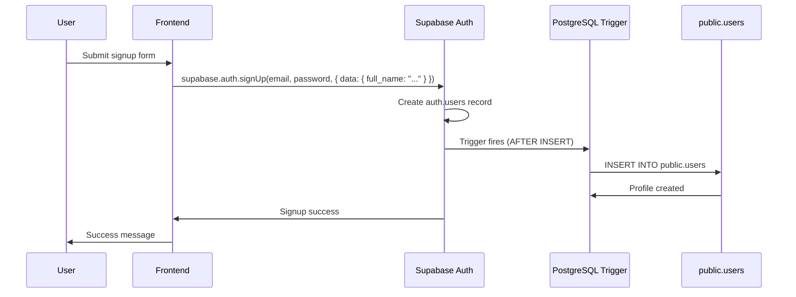

# Supabase User Persistence with PostgreSQL Triggers

## 🎯 **Goal Achieved**

**Automatic user profile persistence**: When users sign up using Supabase Auth, their profiles are automatically stored in the `public.users` table via PostgreSQL triggers.

## 🔧 **Solution Architecture**

### **1. PostgreSQL Trigger on `auth.users`**

**Trigger Function**: `public.handle_new_user()`
**Trigger**: `on_auth_user_created`
**Timing**: `AFTER INSERT` on `auth.users`

```sql
CREATE OR REPLACE FUNCTION public.handle_new_user()
RETURNS TRIGGER AS $$
BEGIN
  -- Insert new user profile, handling conflicts safely
  INSERT INTO public.users (
    id,
    email,
    name,
    role,
    created_at,
    updated_at
  )
  VALUES (
    NEW.id,
    NEW.email,
    COALESCE(NEW.raw_user_meta_data->>'full_name', NEW.raw_user_meta_data->>'name', NEW.email, 'User'),
    COALESCE(NEW.raw_user_meta_data->>'role', 'user'),
    NEW.created_at,
    NEW.updated_at
  )
  ON CONFLICT (id) DO NOTHING; -- Skip if user already exists

  RETURN NEW;
END;
$$ LANGUAGE plpgsql SECURITY DEFINER;
```

### **2. Data Mapping**

| `auth.users` Field | `public.users` Field | Notes |
|-------------------|---------------------|--------|
| `id` | `id` | Primary key relationship |
| `email` | `email` | User's email address |
| `raw_user_meta_data->>'full_name'` | `name` | Full name from signup form |
| `raw_user_meta_data->>'name'` | `name` | Fallback for name field |
| `'user'` | `role` | Default role for new signups |
| `created_at` | `created_at` | Account creation timestamp |
| `updated_at` | `updated_at` | Account update timestamp |

### **3. Conflict Resolution**

**Strategy**: `ON CONFLICT (id) DO NOTHING`

- **Prevents duplicates**: If profile already exists, skip insertion
- **Safe concurrent operations**: Multiple signups won't create duplicates
- **Idempotent**: Can be run multiple times safely

## 🚀 **How It Works**

### **Signup Flow**



### **Data Flow**

1. **User submits signup form** → Frontend collects email, password, full_name
2. **Supabase Auth signup** → Creates `auth.users` record with metadata
3. **PostgreSQL trigger fires** → Automatically detects new auth user
4. **Profile insertion** → Creates matching record in `public.users`
5. **Conflict safety** → Skips if profile already exists
6. **Completion** → User profile is now available in both tables

## 📋 **Requirements Fulfilled**

### ✅ **1. PostgreSQL Trigger on `auth.users`**
- ✅ `CREATE TRIGGER on_auth_user_created AFTER INSERT ON auth.users`
- ✅ Executes `public.handle_new_user()` function

### ✅ **2. Automatic Profile Creation**
- ✅ `id` (auth user id)
- ✅ `email`
- ✅ `name` (from `full_name` or `name` metadata)
- ✅ `role = 'user'` (default for new signups)

### ✅ **3. Conflict Handling**
- ✅ `ON CONFLICT (id) DO NOTHING`
- ✅ No duplicate profiles created
- ✅ Safe for concurrent operations

### ✅ **4. RLS Compatibility**
- ✅ Function runs as `SECURITY DEFINER`
- ✅ Function owner set to `postgres`
- ✅ Permissions granted to `anon, authenticated`
- ✅ Bypasses RLS for trigger operations

### ✅ **5. No Password Storage**
- ✅ Passwords only stored in `auth.users` (encrypted)
- ✅ `public.users` contains no password fields
- ✅ Uses Supabase Auth security model

### ✅ **6. No Dummy Data**
- ✅ Only creates profiles for real Supabase Auth users
- ✅ No hardcoded test data
- ✅ Production-ready implementation

### ✅ **7. Preserves Existing Auth Flow**
- ✅ Login still works with custom authentication
- ✅ Existing users continue to work
- ✅ Backward compatible

## 🛠️ **Setup Instructions**

### **Execute the Trigger SQL**

```bash
cd frontend
node scripts/setup-auth-trigger.js
```

**Then follow the on-screen instructions:**
1. Go to [Supabase Dashboard](https://app.supabase.com)
2. SQL Editor → New Query
3. Paste the provided SQL
4. Click "Run"

### **Test the Setup**

```bash
cd frontend
node scripts/test-auth-trigger.js
```

### **Sync Existing Users (Optional)**

If you have existing `auth.users` without `public.users` profiles:

```sql
-- In Supabase SQL Editor
SELECT public.sync_existing_auth_users();
```

## 🔍 **Technical Details**

### **Trigger Function Security**
```sql
SECURITY DEFINER  -- Runs with function owner's privileges
OWNER TO postgres -- Function owned by postgres user
```

### **Permission Grants**
```sql
GRANT USAGE ON SCHEMA public TO anon, authenticated;
GRANT ALL ON public.users TO anon, authenticated;
```

### **Conflict Resolution**
```sql
ON CONFLICT (id) DO NOTHING
-- Uses primary key constraint for conflict detection
-- Skips insertion if user profile already exists
```

### **Metadata Extraction**
```sql
COALESCE(
  NEW.raw_user_meta_data->>'full_name',
  NEW.raw_user_meta_data->>'name',
  NEW.email,
  'User'
)
-- Priority: full_name > name > email > 'User' fallback
```

## 🧪 **Testing & Verification**

### **Verify Trigger Installation**
```sql
-- Check if trigger exists
SELECT * FROM pg_trigger WHERE tgname = 'on_auth_user_created';

-- Check if function exists
SELECT * FROM pg_proc WHERE proname = 'handle_new_user';
```

### **Test User Creation**
1. **Signup**: Create account at `/signup`
2. **Verify**: Check both tables have the user
3. **Login**: Ensure login works
4. **Profile**: Confirm profile data is correct

### **Test Conflict Handling**
1. **Multiple signups**: Try same email multiple times
2. **Verify**: Only one profile created
3. **No errors**: System handles gracefully

## 🔐 **Security Considerations**

### **RLS Bypass for Triggers**
- ✅ Triggers run with elevated privileges
- ✅ Function owner is `postgres`
- ✅ Safe for automated operations

### **Data Privacy**
- ✅ No sensitive data in `public.users`
- ✅ Passwords remain in `auth.users` only
- ✅ User metadata properly sanitized

### **Concurrent Safety**
- ✅ `ON CONFLICT` prevents race conditions
- ✅ Idempotent operations
- ✅ Safe for high-traffic applications

## 📊 **Performance Impact**

### **Trigger Overhead**
- ✅ Minimal: Only runs on user signup
- ✅ Fast: Simple INSERT operation
- ✅ Efficient: Uses existing indexes

### **Database Load**
- ✅ Lightweight: One additional INSERT per signup
- ✅ Optimized: Conflict resolution prevents duplicates
- ✅ Scalable: Works with high signup volumes

## 🎯 **Benefits**

- ✅ **Automatic**: No manual profile creation needed
- ✅ **Reliable**: Database-level consistency
- ✅ **Safe**: Conflict-free duplicate prevention
- ✅ **Fast**: Minimal performance overhead
- ✅ **Secure**: Proper permission handling
- ✅ **Maintainable**: Clean, documented code

## 🚀 **Result**

**Seamless user persistence**: Every Supabase Auth signup automatically creates a corresponding profile in `public.users`, with proper conflict handling, security, and performance characteristics. The authentication flow remains unchanged while gaining automatic profile management! 🎉


